# Accountability Module: Increasing Trust in Reinforcement Learning Agents

**MSc Thesis — University of Oslo, 2023**

## Abstract

Artificial Intelligence requires trust to be fully utilised by users and for them to feel safe while using them. Trust, and indirectly a sense of safety, has been overlooked in the pursuit of more accurate or better-performing black box models. The field of Explainable Artificial Intelligence and the current recommendations and regulations around Artificial Intelligence require more transparency and accountability from governmental and private institutes.

Creating a self-explainable AI that can be used to solve a problem while explaining its reasoning is challenging to develop. Still, it would be unable to explain all the other AIs without self-explainable abilities. It would likely not function for different problem domains and tasks without extensive knowledge about the model.

The solution proposed in this thesis is the **Accountability Module** — an external explanatory module designed to function with different AI models in different problem domains. The prototype was inspired by accident investigations regarding autonomous vehicles but was created and implemented for a simplified simulation of vehicles driving on a highway. The prototype's goal was to attempt to assist an investigator in understanding why the vehicle crashed.

The Accountability Module found the main factors in the decision that resulted in an accident. It was also able to facilitate the answering of whether the outcome was avoidable and if there were inconsistencies with the agent's logic by examining different cases against each other. The prototype managed to provide useful explanations and assist investigators in understanding and troubleshooting agents.

---

## The Environment

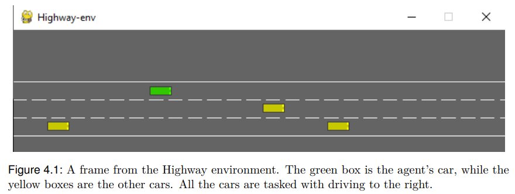
*Figure 4.1 — The Highway-env simulation. The green box is the agent's car; yellow boxes are other vehicles.*

The agent observes the environment through two representations: a greyscale image and a kinematic matrix encoding the positions and velocities of nearby vehicles.

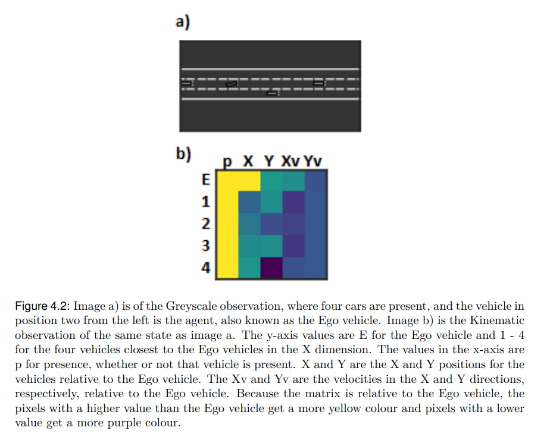
*Figure 4.2 — Greyscale observation (a) and the corresponding kinematic matrix (b). Rows are the ego vehicle (E) and four closest vehicles; columns are presence, X/Y positions, and X/Y velocities.*

---

## The Accountability Module

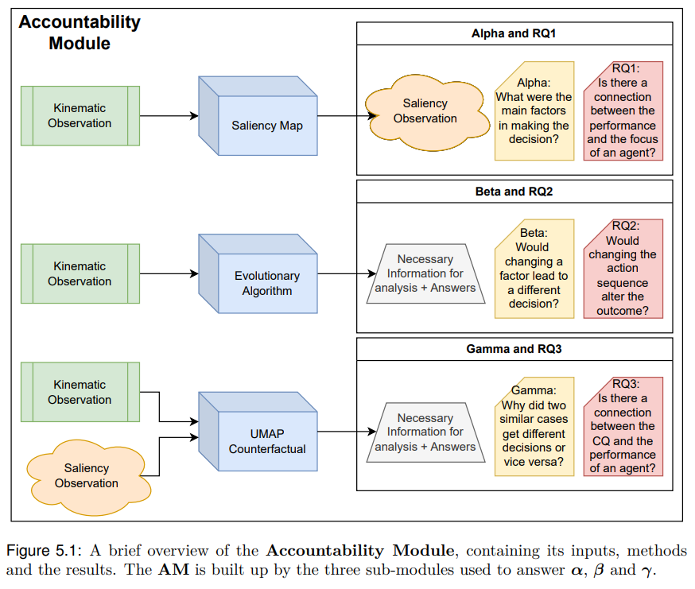
*Figure 5.1 — Architecture of the Accountability Module. Three sub-modules (Alpha, Beta, Gamma) each answer a distinct research question.*

| Symbol | Research Objective | Method | Research Question |
|---|---|---|---|
| α | What were the main factors in the decision? | Saliency Maps | Is there a connection between performance and the focus of an agent? |
| β | Would changing a factor lead to a different decision? | Evolutionary Algorithm | Would changing the action sequence alter the outcome? |
| γ | Why did two similar cases get different decisions? | UMAP + Counterfactuals | Is there a connection between clustering quality and agent performance? |

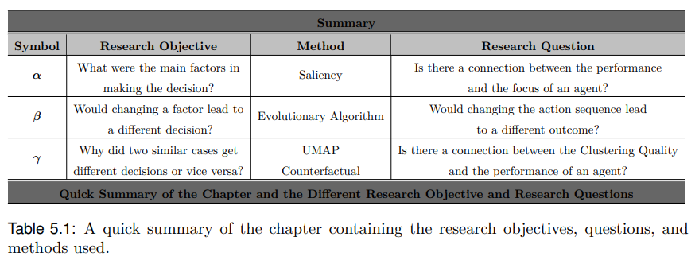

---

## Saliency — What Did the Agent Focus On?

Saliency maps reveal which parts of the kinematic observation drove the agent's decision. Blue = high focus, red = low focus.

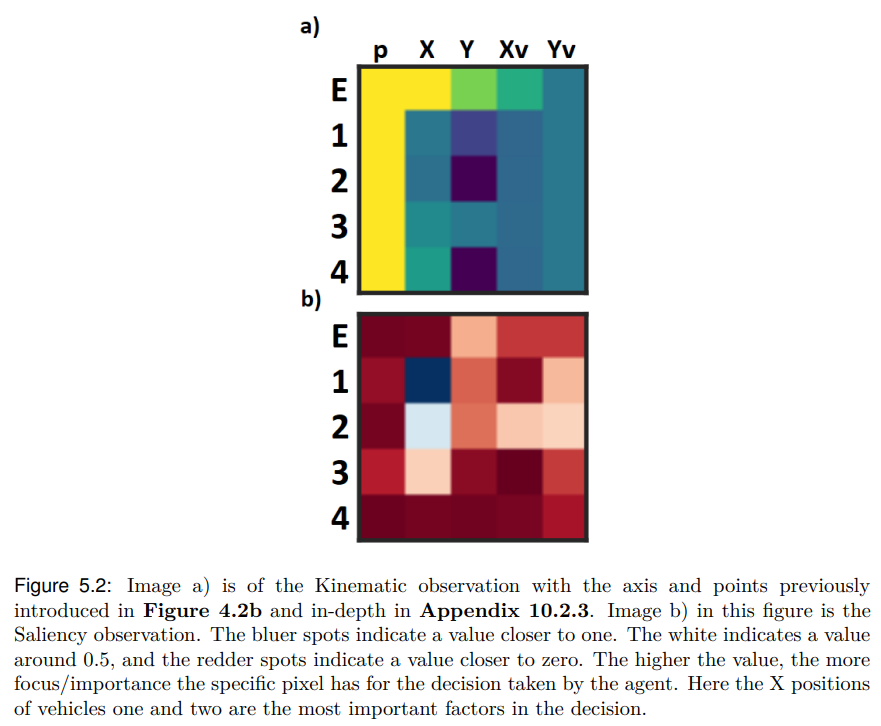
*Figure 5.2 — Kinematic observation (a) and corresponding saliency map (b). The X positions of vehicles one and two are the most important factors.*

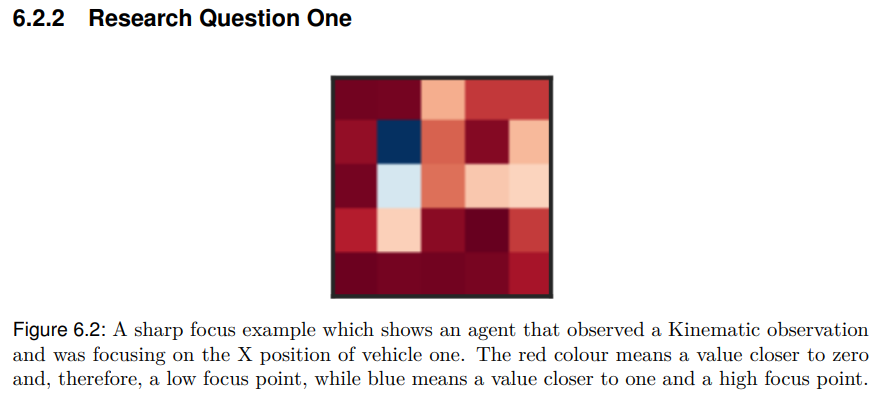
*Figure 6.2 — A sharp focus example: the agent focused almost entirely on the X position of vehicle one.*

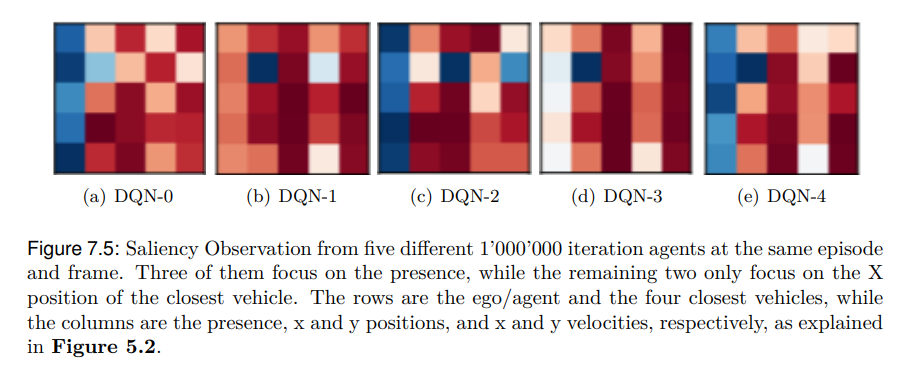
*Figure 7.5 — Saliency from five independently trained DQN-1M agents at the same frame. Three focus on vehicle presence; two focus only on the X position of the closest vehicle.*

---

## UMAP — Clustering Agent Behaviour

UMAP projects the high-dimensional observation space into 2D, revealing how an agent clusters its decisions. Outliers highlight inconsistent behaviour.

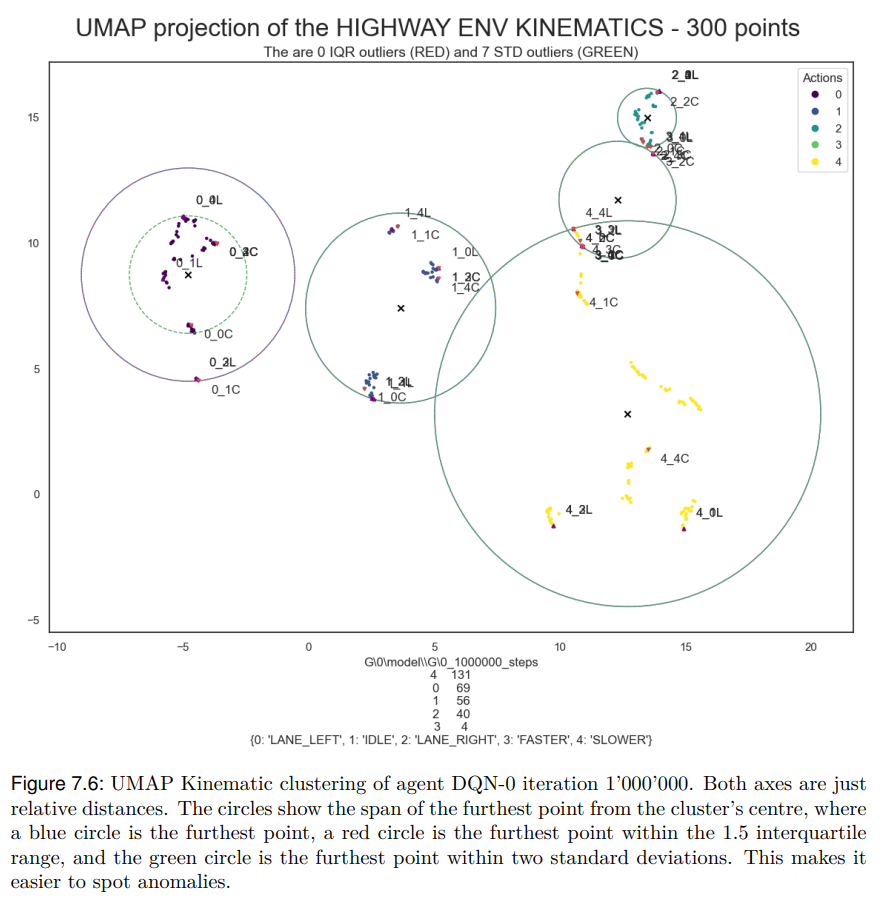
*Figure 7.6 — UMAP projection of kinematic observations. Each cluster corresponds to a dominant action.*

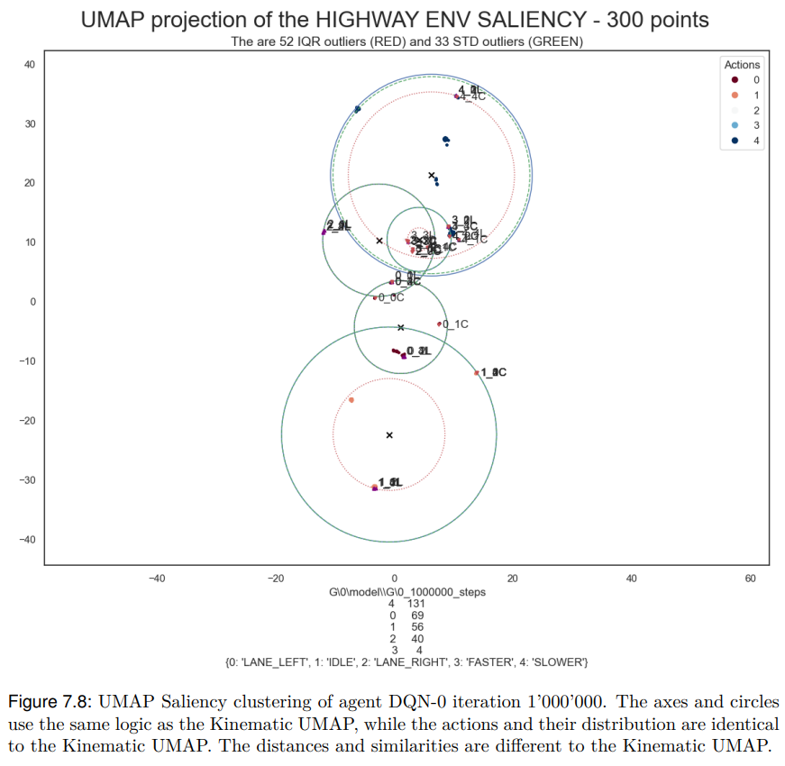
*Figure 7.8 — UMAP projection of saliency observations. Cluster distribution matches kinematics but distances differ.*

---

## Counterfactuals — Was a Different Outcome Possible?

By finding the most and least similar observations across UMAP clusters, the module constructs counterfactual pairs showing what the agent would have needed to see to act differently.

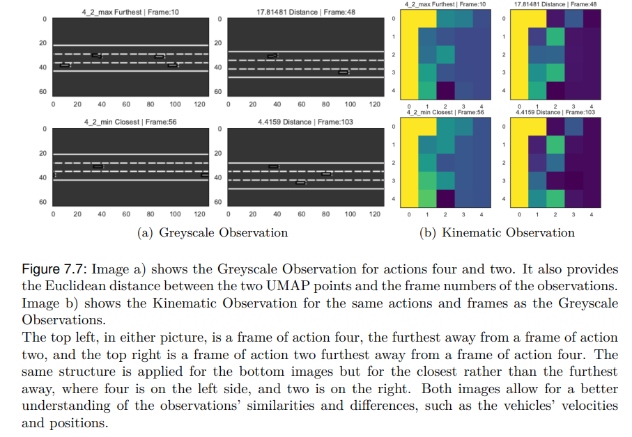
*Figure 7.7 — Counterfactual pair for actions 4 and 2: furthest (top) and closest (bottom) UMAP points, shown as greyscale (a) and kinematic (b).*

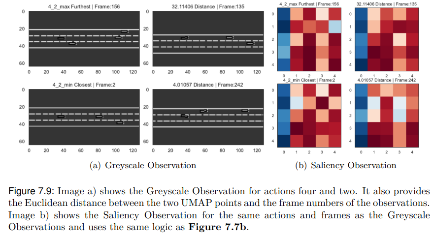
*Figure 7.9 — Same counterfactual pair with saliency observations (b) instead of kinematic.*

---

## Tech Stack

Python · PyTorch · stable-baselines3 · DQN · highway-env · UMAP · Ray · CUDA

---

## Thesis

[Eyosiyas_Master.pdf](./Eyosiyas_Master.pdf) (130 pages)
